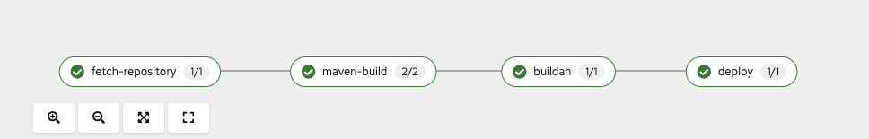
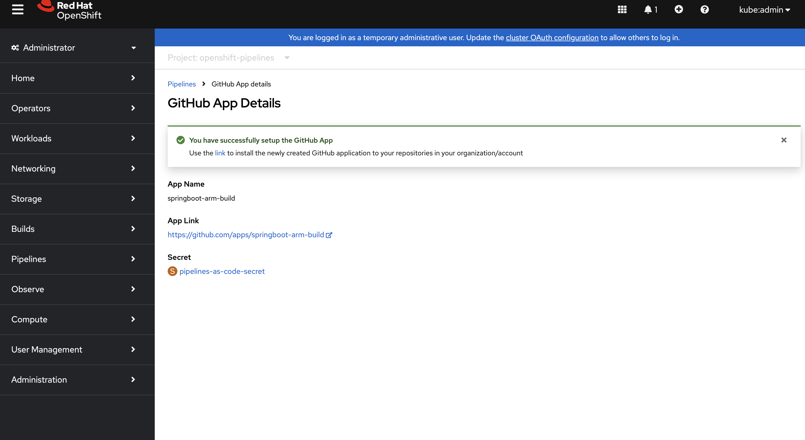
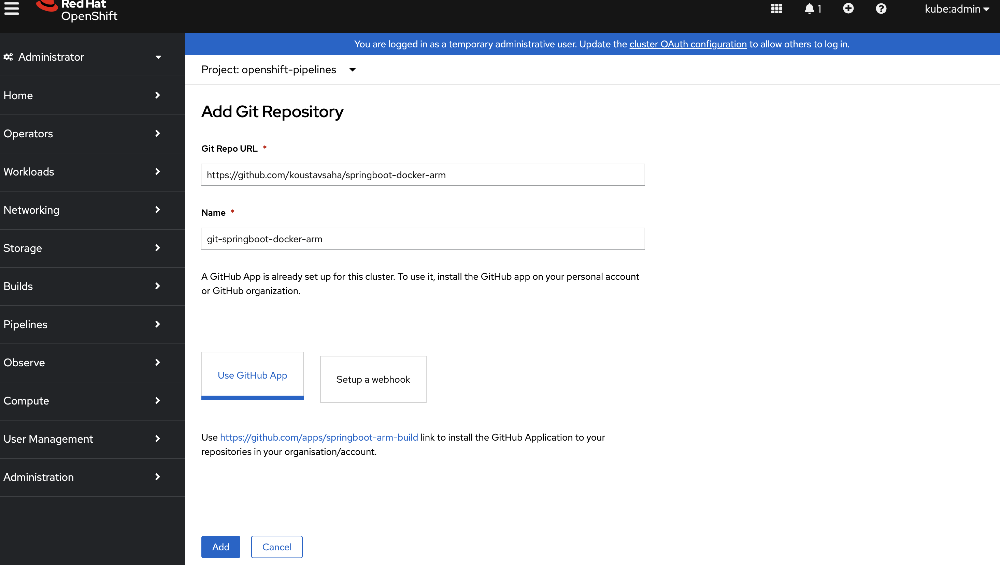
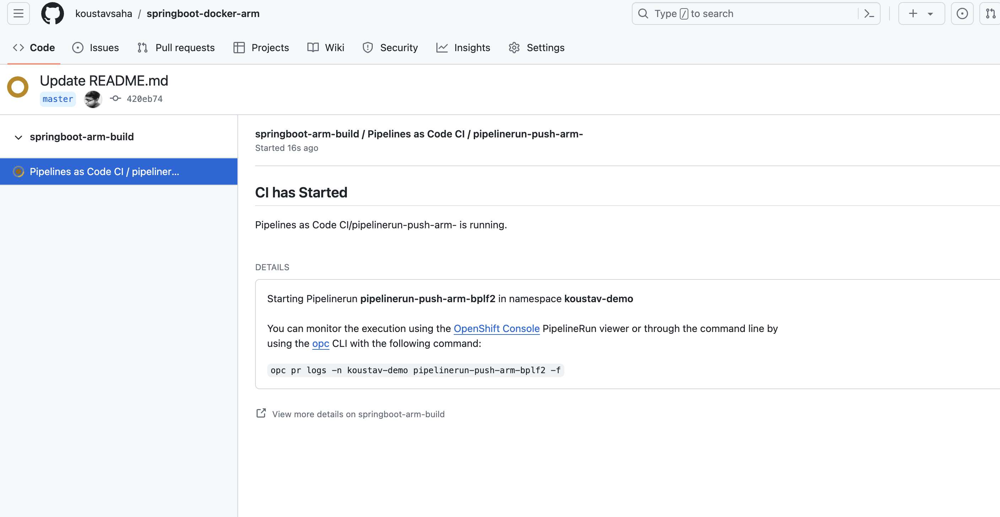
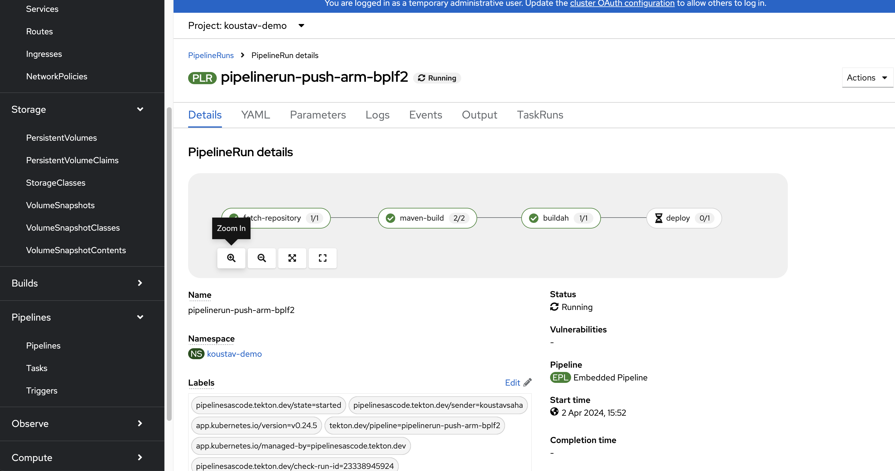
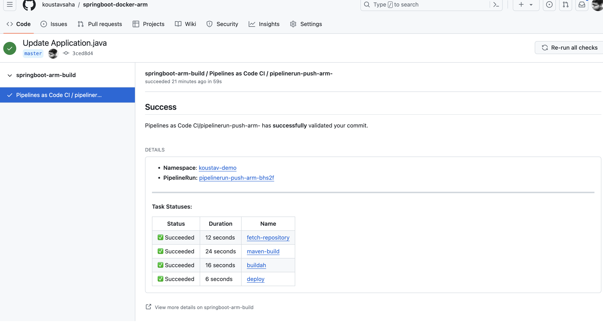
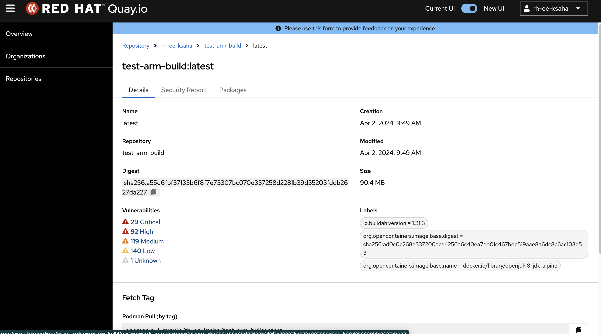
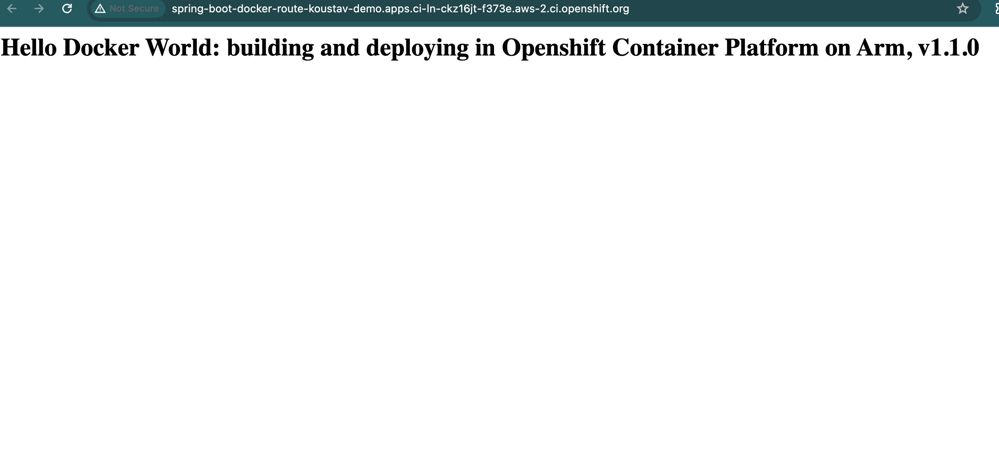

# Building and Deploying applications with Red Hat OpenShift Container Platform on Arm with Tekton

#### Author: Koustav Saha

Arm-based systems are making waves with Apple, AWS, Azure and emerging server markets. Their [performance and low power consumption](https://www.arm.com/blogs/blueprint/performance-per-watt) offer vast opportunities across data centers, cloud, and Edge computing. Industries like Telco, Finance, and Manufacturing are embracing this revolution, marking a year of major Arm adoption. 
We all know that different workloads have different needs, run better on some architectures than others and even have different requirements based on where they will be located. Since Red Hat OpenShift Container Platform can run on Arm architecture, our goal is to improve the user experience when building and deploying applications that are best suited for Arm. We aim to achieve this by leveraging Red Hat's supported CI/CD solutions and tools.
In this blog, we'll walk you through building a [straightforward Spring Boot Java application](https://github.com/koustavsaha/springboot-docker-arm) using OpenShift Pipelines (Tekton), crafting an Arm image, and seamlessly deploying the app—all within the OpenShift Container Platform on Arm.

## Getting OpenShift Container Platform running on Arm
In this blog, we'll work with a dedicated OpenShift cluster equipped with Arm compute nodes. OpenShift can be installed on Arm across various settings, from on-premises hardware and Arm-supported public clouds (like AWS, Azure, Google Cloud) to developer workstations. Check out this [article](https://access.redhat.com/articles/6804741) for insights on tested integrations and the popular combinations that Red Hat OpenShift Container Platform (OCP) users prefer for Arm architecture.

## Introducing OpenShift Pipelines (Tekton) for Arm
We'll leverage [Red Hat OpenShift Pipelines](https://www.redhat.com/en/technologies/cloud-computing/openshift/pipelines#:~:text=OpenShift%20Pipelines%20provides%20a%20cloud,of%20applications%20and%20Kubernetes%20clusters.), fully supported by Red Hat, within the Arm-powered OpenShift Container Platform to craft advanced continuous integration (CI) workflows for our application. It builds on the open source [Tekton](https://tekton.dev/) framework to provide a continuous integration and continuous deployment (CI/CD) experience through tight integration with OpenShift and Red Hat developer tools. Openshift Pipelines is available as a Red Hat supported operator in the Openshift Container Platform and you can [install it](https://docs.openshift.com/pipelines/1.12/install_config/installing-pipelines.html) from console or cli. 

## Building the Tekton Pipeline: Explained
As part of this blog, our tekton pipeline will be consisting of four key tasks:

For each of the tasks, we use ClusterTask that are shipped with Openshift Pipelines operator and supported by Red Hat

- ```fetch-repository```: This task clones the repository using the git-clone ClusterTask.
  ```YAML
   # 1. Task - fetch-repository
    - name: fetch-repository
      taskRef:
        name: git-clone
        kind: ClusterTask
      params:
      - name: url
        value: $(params.repo-url)
      - name: revision
        value: $(params.tag-name)
      - name: deleteExisting
        value: "true"
      workspaces:
      - name: output
        workspace: workspace
  ```
- ```maven-build```: This task uses the maven ClusterTask to build the project and package the resulting JAR file. The maven image supported by Red Hat is compatible with Arm architecture.
  ```YAML
    # 2. Task - maven build
  - name: maven-build
    taskRef:
      name: maven
      kind: ClusterTask
    runAfter:
    - fetch-repository
    params:
    - name: GOALS
      value:
        - -B
        - -DskipTests
        - clean
        - package
    workspaces:
    - name: maven-settings
      workspace: maven-settings
    - name: source
      workspace: workspace
  ```
- ```buildah```: This task constructs an OCI image with the desired target architecture (--arch arm64) using the [buildah](https://buildah.io/) ClusterTask. Quay credentials are passed as a workspace, along with the source repo workspace, to push the built image to a public Quay repository.
  ```YAML
  # 3. Task - buildah build & push to quay
  - name: buildah
    taskRef:
      name: buildah
      kind: ClusterTask
    runAfter:
    - maven-build
    params:
      - name: IMAGE
        value: "$(params.image-full-path-with-tag)"
      - name: BUILD_EXTRA_ARGS
        value: "--arch arm64"
      - name: TLSVERIFY
        value: "false"
      - name: STORAGE_DRIVER
        value: "vfs"
    workspaces:
      - name: source
        workspace: workspace
      - name: dockerconfig
        workspace: quay-cred
  ```
- ```deploy```: This task uses the openshift-client ClusterTask to create deployment, service, and route for the application in the OpenShift Container Platform on Arm.
  ```YAML
  # 5. Task - kubectl deploy
  - name: deploy
    taskRef:
      name: openshift-client
      kind: ClusterTask
    runAfter:
    - buildah
    params:
      - name: SCRIPT
        value: |
          oc apply --filename k8s/
          echo "----------"
          oc patch deployment spring-boot-docker -p '{"spec":{"template":{"spec":{"containers":[{"name":"myapp","image":"$(params.image-full-path-with-tag)"}]}}}}'
          oc get deployment
    workspaces:
      - name: manifest-dir
        workspace: workspace
  ```
The full pipeline you can find [here](https://github.com/koustavsaha/springboot-docker-arm/blob/master/.tekton/pipeline-push-arm.yaml). 

## Pipelines as Code: Simplifying Workflow
Openshift Pipelines ships with [Pipelines as code](https://pipelinesascode.com/) that allows you to define your CI/CD using Tekton PipelineRuns and Tasks in a file located in your source control management (SCM) system, such as GitHub or GitLab. This file is then used to automatically create a pipeline for a Pull Request or a Push to a branch. By storing the pipeline definition in code, it becomes easier to version, review, and collaborate on pipeline changes with code changes, thus enable tracking using a Git workflow.

In our setup, we'll store our pipeline and PipelineRun in the ```.tekton``` directory of our repository, with the PipelineRun set to trigger upon a push event in the master branch.

We have tightly integrated Pipelines As Code with Openshift console. We will use the console to create a Github App which automatically helps create and install with proper Github permissions needed for Pipelines As Code. This also creates Kubernetes secret containing the private key of the GitHub App and the webhook secret of the Pipelines-as-Code. 



Following this integration, we create a Pipelines as Code repository Custom Resource (CR) linked to our source code repository. This CR automatically detects the previously configured Github app and attaches it to the repository CR, residing in the desired namespace for the PipelineRun to take place.



Our source code repository features a ```.tekton``` directory housing the PipelineRun and pipeline YAML file. In the PipelineRun YAML, we've added Pipelines as Code annotations as follows:
```YAML
    pipelinesascode.tekton.dev/target-namespace: koustav-demo
    pipelinesascode.tekton.dev/max-keep-runs: "5"
    pipelinesascode.tekton.dev/on-event: "[push]"
    pipelinesascode.tekton.dev/on-target-branch: master
    pipelinesascode.tekton.dev/pipeline: ".tekton/pipeline-push-arm.yaml"
```
These annotations dictate that when new source code changes are pushed to our master branch, it automatically triggers the defined pipeline, resulting in the creation and deployment of an Arm-compatible OCI image to the Quay repository, followed by deploying the newly created image for the app.

## Triggering the Tekton Pipeline: The Arm Image Journey
We created -
- A ```persistentVolumeClaim``` for our pipeline workspace
- A k8s ```secret``` for quay credentials 
- A ```configMap``` for maven settings 

Next, we made some changes to the source code repository and pushed our changes to the master branch.





The push event automatically triggered the Tekton Pipeline for building and deploying an Arm image.



The pipeline created [quay.io/rh-ee-ksaha/test-arm-build:latest]() image. Red Hat Quay also performs security checks on the image and published it along with various image metadata.



Finally, our application is deployed as part of the pipeline in Openshift Container Platform on Arm. 



